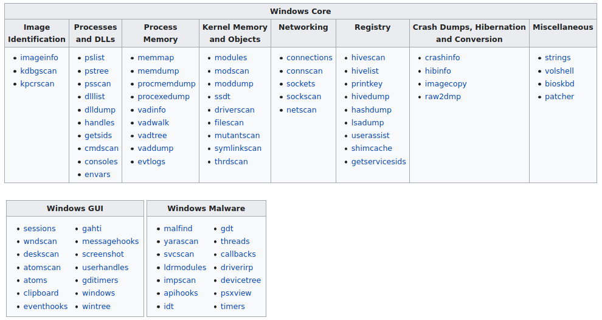

# Forensic

## Volatility

```bash=
    volatility -f MEMORY_FILE.raw imageinfo                                                             #provide us with a number of profiles              
    volatility -f MEMORY_FILE.raw --profile=PROFILE pslist                                              #test these profiles using the pslist command
    volatility -f MEMORY_FILE.raw --profile=PROFILE netscan                                             #view active network connections at the time of image creation
    volatility -f MEMORY_FILE.raw --profile=PROFILE psxview                                             #view malware to attempt to hide itself and the process associated with it
    volatility -f MEMORY_FILE.raw --profile=PROFILE ldrmodules                                          #greater focus hidden processes
    volatility -f MEMORY_FILE.raw --profile=PROFILE apihooks                                            #view unexpected patches in the standard system DLLs
    volatility -f MEMORY_FILE.raw --profile=PROFILE malfind -D <Destination Directory>                  #Injected code can be a huge issue and is highly indicative of very very bad things.
    volatility -f MEMORY_FILE.raw --profile=PROFILE dlllist                                             #view all of the DLLs loaded into memory / DLLs are shared system libraries utilized in system processes
    volatility -f MEMORY_FILE.raw --profile=PROFILE --pid=PID dlldump -D <Destination Directory>        #dump DLL
    volatility -f MEMORY_FILE.raw --profile=PROFILE hivelist                                            #dump the hives. We are interested in 2 offsets: SYSTEM (-y) and SAM (-s)
    volatility -f MEMORY_FILE.raw --profile=PROFILE hashdump -y <n°virt.> -s <n°virt.> >> hashes.txt    #Find hashes
    volatility -f MEMORY_FILE.raw --profile=PROFILE consoles                                            #extract command history
    volatility -f MEMORY_FILE.raw --profile=PROFILE shutdowntime                                        #last shutdown machine
    volatility -f MEMORY_FILE.raw --profile=PROFILE truecryptpassphrase                                 #passphrase partition truecrypt
    volatility -f MEMORY_FILE.raw --profile=PROFILE shellbags                                           #show last directory open
    volatility -f victim.raw -p <malicious PID> --profile=Win7SP1x64 memdump <Directory to save the file> #dump memory of specific PID
 
```
Cas pratique de Volatility
```bash=


