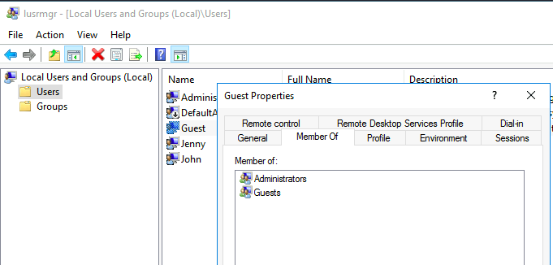
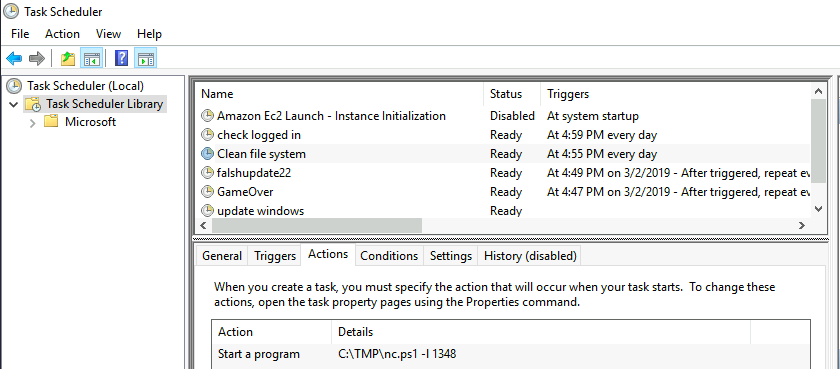
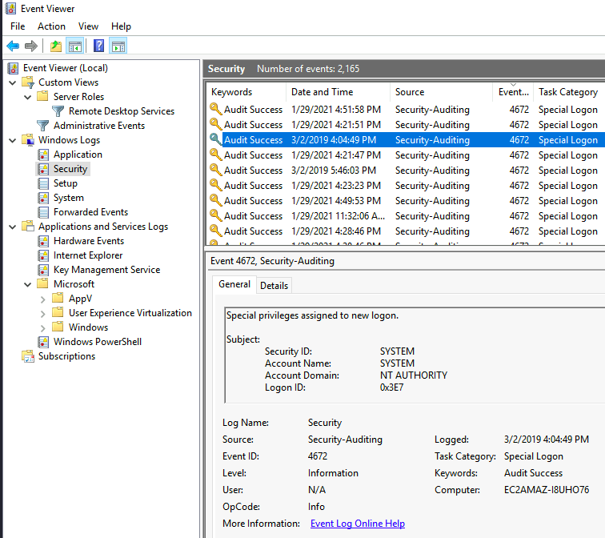
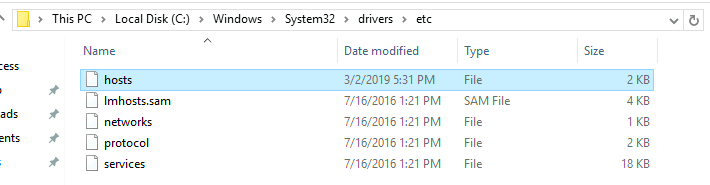
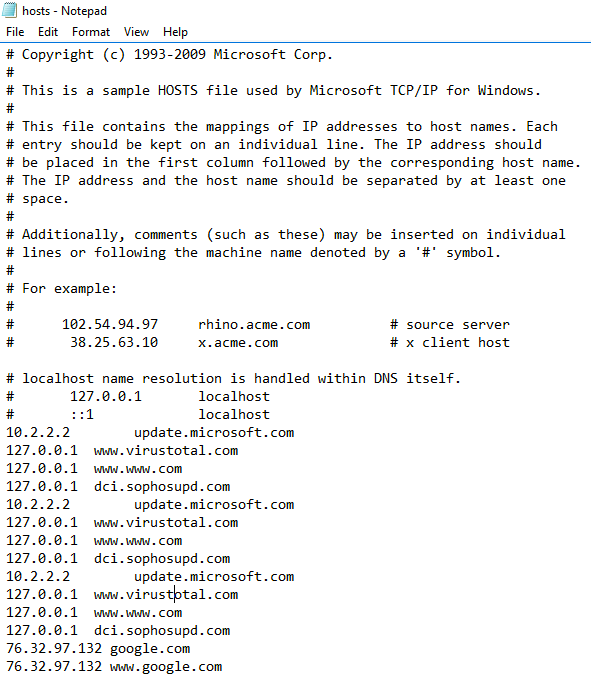

# Investigation Windows

## Active Directory

### Enum4linux
[Source](https://www.kali.org/tools/enum4linux/)
[TryhackMe](https://tryhackme.com/room/investigatingwindows)

## Bloodhound

    ```bash=
    sudo apt install Bloodhound
    ``` 
-> install bloodhound
```bash=
sudo neo4j console
```
-> launch neo4j console
http://localhost:7474/browser/ -> neo4j browser
<br/>change password 
```bash=
sudo bloodhound
```
-> launch bloodhound
```bash=
git clone https://github.com/fox-it/BloodHound.py.git
```
-> clone de bloodhound.py to import json file to map infra
```bash=
sudo python3 bloodhound.py -u <user> -p <passwd> -c all -d <domain> -ns <ip>
```
-> command line to import json file
## System info

    ```bash=
    systeminfo
    ```
## Last logon time for <user>

    ```bash=
    net user <user> | findstr /B /C:"Last logon"
    ```

## Users with privilege

### CMD command line

    ```bash=
    net user <user>
    ```

### Using tool

The fastest way to open Local Users and Groups is to type **lusrmgr.msc** in the search bar. If you prefer, you can also right-click on the Windows start menu and click on Computer Management. When the new window appears, click on Local Users and Groups, followed by the Groups option.



Locate the Administrators option and double-click on it. The Administrator Properties window should appear, and when it does, you’ll see what accounts have administrative privileges in the Members box.

## Task Scheduled 



## Windows first assign special privileges to a new logon

[Source New Logon](https://docs.microsoft.com/fr-fr/windows/security/threat-protection/auditing/event-4672)



## Fichier Host

le fichier host est particulièrement utile puisqu’il stocke les noms d’hôtes et les adresses IP correspondantes. C’est lui qui est interrogé en premier avant une requête DNS sur les serveurs d’adresse du Web. Ainsi, le fichier host est un outil élémentaire pour un protocole réseau : il convertit les noms d’hôtes en adresses IP numériques. Or, le réseau ne peut fonctionner qu’avec ces adresses. Il est installé sur tous les systèmes d’exploitation courants pour PC, Mac et appareils mobiles. Seuls les administrateurs système peuvent modifier le fichier host. À chaque fois que vous visitez un site Web, votre appareil vérifie d’abord le fichier host pour trouver une entrée ou une règle correspondante pour la page.



