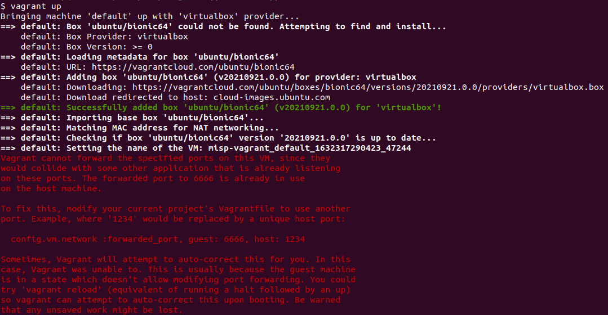
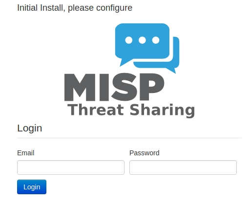
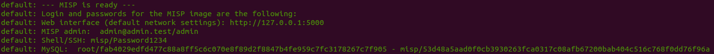
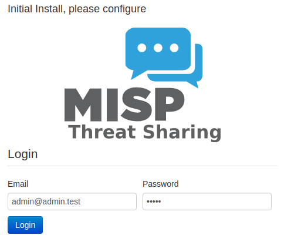
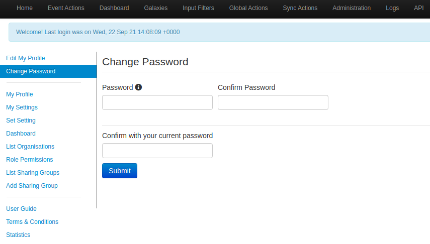
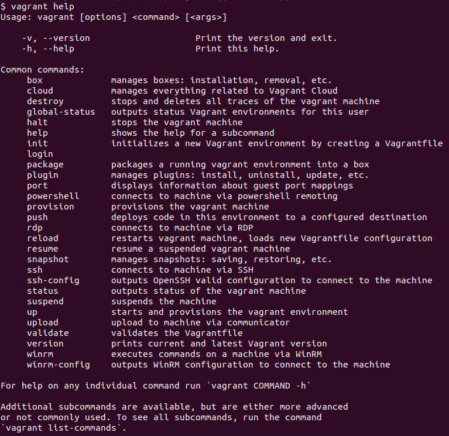

#  Misp

## Installation, backup, and restore instructions for MISP on Ubuntu 16.04 with MariaDB

[Sources](https://github.com/MISP/MISP/issues/1195)

## Misp Vagrant
### 1 - Création d'un user _misp_

```bash=
user$ sudo adduser misp
```  

Suivre les instructions de création d'un nouveau user.  

Sur sa machine, se connecter au user _misp_ :
```bash=
user$ su - misp
user$ mot de passe : "votre mot de passe"
```  

### 2 - Cloner et installer MISP

Aller sur [MISP](https://github.com/MISP/MISP) :  
```bash=
misp$ git clone https://github.com/MISP/MISP.git
misp$ cd MISP/
```  

Installation des submodules :  
```bash=
misp$ git submodule init
misp$ git submodule update
```  

### 3 - Installer MISP Vagrant

Installation de VirtualBow et vagrant :  
```bash=
misp$ sudo apt-get install virtualbox vagrant
```  
Si l'installation de VirtualBox est en échec, redirigez-vous vers [VirtualBox](https://www.virtualbox.org/wiki/Downloads).  

* Déploiement de MISP Vagrant  
    Rendez-vous sur le repo MISP/        
        ```bash= misp$ cd MISP/
        misp$ git submodule update --init misp-vagrant
        misp$ cd misp-vagrant/
        misp$ git pull origin master
        misp$ vagrant up
        ```
    
    <br/>Si vous recontrez l'erreur suivante : 
    

    <br/>Alors, modifier le fichier suivant _Vagrantfile_ (repo ./MISP/misp-vagrant/.):
        ```bash=
        misp$ sudo vim Vagrantfile
        ```
    <br/>Modifier la ligne suivante :
        ```bash=
        config.vm.network :forwarded_port, guest: 6666, host: 6666
        ```
    <br/> par la ligne suivante :
        ```bash=
        config.vm.network :forwarded_port, guest: 6666, host: 1234
        ```
    <br/>Puis relancer :
    ```bash=
    misp$ vagrant up
    ```

* Installation de MISP Vagrant sans l'environement de développement  

    Aller sur [MISP Vagrant](https://github.com/MISP/misp-vagrant) :  
        ```bash=
        misp$ git clone https://github.com/MISP/misp-vagrant.git
        misp$cd misp-vagrant/
        misp$ export MISP_ENV='demo'
        misp$ vagrant up
        ```  

### 4 - Connexion à MISP

* Lancement de MISP

Dès que l'installation de MISP Vagrant (mode développement ou non) est faîte, connecter vous à [misp_web](http://127.0.0.1:5000).



* Mot de Passe

Lors du lancement de MISP avec la commande ```vagrant up```, la liste des mot de passe est disponible en fin de lancement : 




* Connexion



* Changement de mot de passe



### Vagrant Help

```bash=
misp$ vagrant help
```

## Mise à Jour de MISP


## Sources

- [MISP](https://www.misp-project.org/features.html)  
- [MISP Vagrant](https://github.com/MISP/misp-vagrant)  


