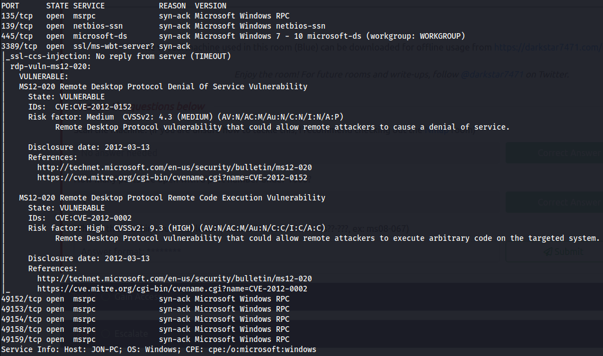
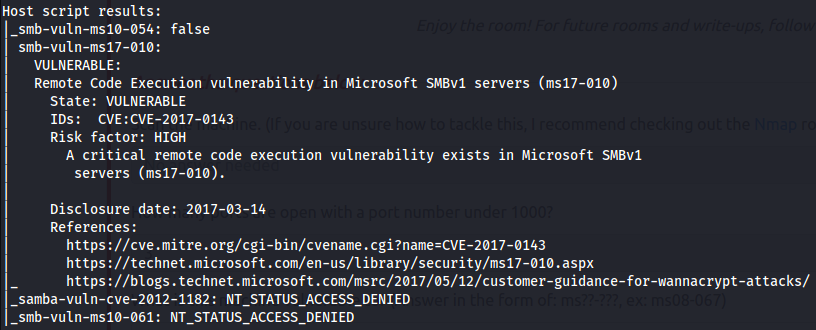

# NMAP

Suffixes : 
* -sV : affiche la version des services existants sur les ports
* -sC : affiche les scripts par défaut qui sont activés sur les ports

Scan simple et rapide : 
* sudo nmap -sS -T5 <ip>

Exemples : 
* N°1 : TryHackMe -> [Ice Room](https://tryhackme.com/room/ice)

    ```bash=
    $ sudo nmap -sS -Pn -sV <ip>
    ```

* N°2 : TryHackMe -> [Ice Room](https://tryhackme.com/room/ice)

    ```bash=
    $ sudo nmap -sS -sC <ip>
    ```

* N°3 : TryHackMe -> [Kenobi Room](https://tryhackme.com/room/kenobi)

    ```bash=
    nmap -p 445 --script=smb-enum-shares.nse,smb-enum-users.nse <ip>
    nmap -p 139 --script=smb-enum-shares.nse,smb-enum-users.nse <ip>
    ```

* N°4 : TryHackMe -> [Blue Room](https://tryhackme.com/room/blue)
    
    ```bash=
    nmap -sV -vv --script vuln <ip>
    ```

    

    
    