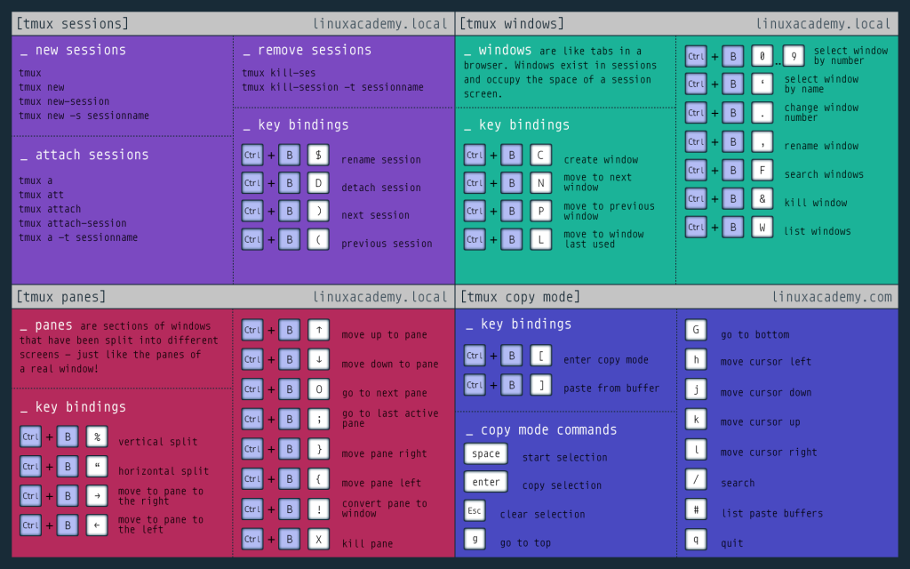

# TMUX



[Tmux Cheat Sheet n°1](https://acloudguru.com/blog/engineering/tmux-cheat-sheet?utm_source=legacyla&utm_medium=redirect&utm_campaign=one_platform)

```bash=
Windows (tabs) afer prefix :
    c  create window
    w  list windows
    n  next window
    p  previous window
    f  find window
    ,  name window
    &  kill window
```
[Tmux Cheat Sheet n°2](https://gist.github.com/MohamedAlaa/2961058)

[NATSEC tmux](https://natsec.github.io/notes/dotfiles/)


